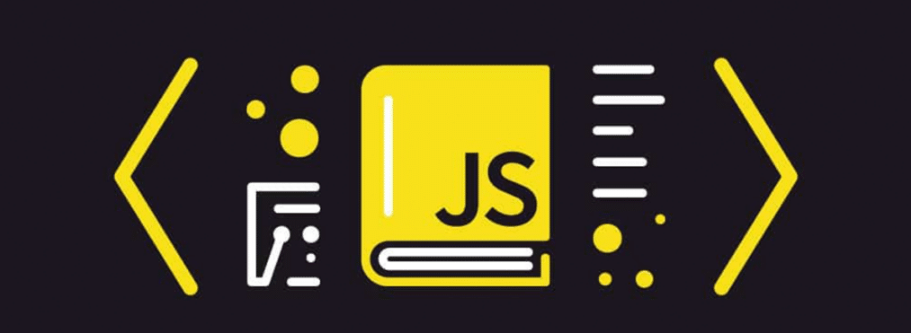

# 💛 JAVASCRIPT ROADMAP

## Apuntes y ejercicios para el estudio de JavaScript 

## INTRODUCTION
Con el fin de afianzar el conocimiento profundo del lenguaje de JavaScript vamos a seguir el camino indicado por roadmap.sh incidiendo punto por punto.
https://roadmap.sh/javascript

>[!IMPORTANT]
> Si lo consideras útil, apóyalo haciendo "★ Star" en el repositorio. ¡Gracias! 💛

## ANTED DE EMPEZAR
- Introducción
- ¿Cómo Funcionará?
- Instalaciones recomendadas
- Configuración del equipo
---
---
 

### **1️⃣ Introducción a JavaScript**  
- Qué es JavaScript  
- Historia de JavaScript  
- Cómo funciona JavaScript  

### **2️⃣ Todo sobre variables**  
- Declaración de variables  
  - `var`  
  - `let`  
  - `const`  
- Ámbito (Scope)  
  - Global  
  - Local  
  - Bloque  
- Hoisting  

### **3️⃣ Tipos de Datos**  
- Tipos primitivos  
  - `string`  
  - `number`  
  - `boolean`  
  - `null`  
  - `undefined`  
  - `bigint`  
  - `symbol`  
- Tipos de referencia  
  - `object`  
  - `array`  
  - `function`  
- Conversión de tipos  
  - Coerción implícita  
  - Coerción explícita  

### **4️⃣ Operadores en JavaScript**  
- Operadores aritméticos  
- Operadores de asignación  
- Operadores de comparación  
- Operadores lógicos  
- Operador ternario  
- Operadores de bit  

### **5️⃣ Estructuras de Control**  
- Condicionales  
  - `if` / `else` / `else if`  
  - `switch`  
- Bucles  
  - `for`  
  - `while`  
  - `do while`  
  - `for...in`  
  - `for...of`  
- Manejo de errores  
  - `try` / `catch` / `finally`  

### **6️⃣ Funciones en JavaScript**  
- Declaración de funciones  
  - Funciones normales (`function`)  
  - Funciones de expresión  
  - Funciones flecha (`=>`)  
- Parámetros y argumentos  
- Valores de retorno  
- Funciones de orden superior  
- Callbacks  
- Closure  
- IIFE (Immediately Invoked Function Expression)  

### **7️⃣ Objetos y POO (Programación Orientada a Objetos)**  
- Creación de objetos  
- Propiedades y métodos  
- `this` en JavaScript  
- Prototipos  
- Herencia en JavaScript  
- Clases (`class`)  
- Métodos estáticos y de instancia  
- `getter` y `setter`  

### **8️⃣ Arrays y Métodos de Arrays**  
- Creación de Arrays  
- Métodos de manipulación  
  - `push()`  
  - `pop()`  
  - `shift()`  
  - `unshift()`  
  - `splice()`  
  - `slice()`  
- Métodos de iteración  
  - `forEach()`  
  - `map()`  
  - `filter()`  
  - `reduce()`  
  - `find()`  
  - `some()`  
  - `every()`  
- Ordenamiento y transformación  
  - `sort()`  
  - `reverse()`  

### **9️⃣ Programación Asíncrona en JavaScript**  
- Callbacks  
- Promesas  
  - `then()`  
  - `catch()`  
  - `finally()`  
- `async` / `await`  
- Manejo de errores en código asíncrono  

### **🔟 Manipulación del DOM**  
- Seleccionar elementos del DOM  
  - `getElementById()`  
  - `getElementsByClassName()`  
  - `querySelector()`  
  - `querySelectorAll()`  
- Modificar elementos  
  - `innerText` / `innerHTML`  
  - `setAttribute()` / `getAttribute()`  
  - `classList`  
- Eventos en JavaScript  
  - `addEventListener()`  
  - Propagación de eventos (bubbling & capturing)  
  - Delegación de eventos  

### **1️⃣1️⃣ Fetch API y Ajax**  
- `fetch()`  
- Métodos de petición HTTP (`GET`, `POST`, `PUT`, `DELETE`)  
- Manejo de respuestas  
  - `.json()`  
  - `.text()`  
- `XMLHttpRequest` (legacy)  

### **1️⃣2️⃣ Local Storage, Session Storage y Cookies**  
- `localStorage`  
- `sessionStorage`  
- `document.cookie`  

### **1️⃣3️⃣ Módulos en JavaScript**  
- `import` y `export`  
- Módulos nativos en ES6  
- CommonJS vs ES Modules  

### **1️⃣4️⃣ Using Browser DevTools**  
- Consola del navegador  
- Debugging en DevTools  
- Monitoreo de red (`Network`)  
- Inspección del DOM  
- Uso del `console.log()` y otras funciones (`console.table()`, `console.warn()`, `console.error()`)  

---
